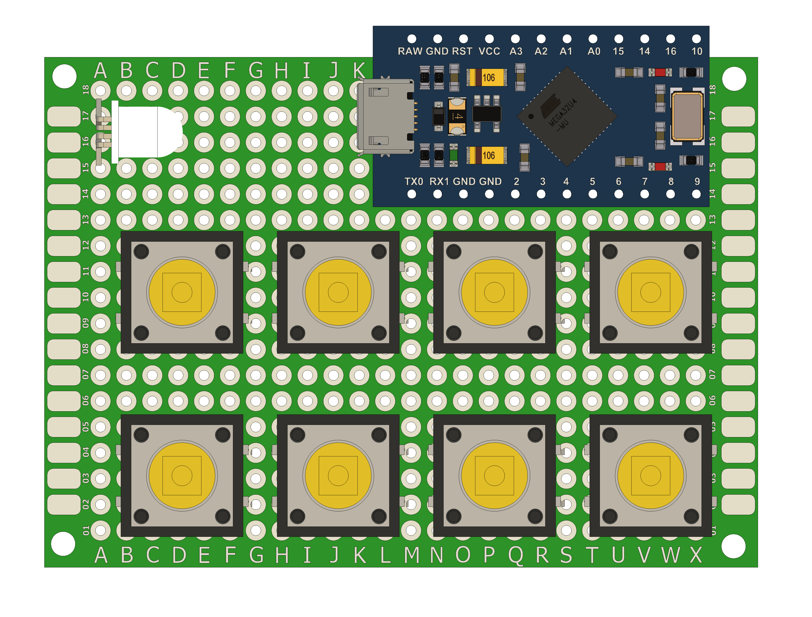

# 🎛️ CtrlDeck

A sleek Arduino-powered media control module with a rotary encoder and 8 customizable buttons for seamless audio and shortcut management.

    <figure>
        
        <figcaption>CtrlDeck</figcaption>
    </figure>
    <figure>
        
        <figcaption>CtrlDeck</figcaption>
    </figure>

## ✨ Features

- 🔄 **Rotary Encoder**: Adjust media volume or navigate effortlessly.
- 🎮 **Customizable Buttons**: 9 programmable buttons for your favorite shortcuts or system controls.
- 💡 **LED Indicators**: RGB LED for visual feedback.
- 💤 **Power Management**: Sleep mode and power-down functionality to save energy.

## 🛠️ Requirements

- 🖥️ Arduino IDE
- 📦 HID-Project Library
- 🌙 LowPower Library

### 🎛️ Usage *(Normal Mode)*

#### 🔧 Programming Mode *(used to stop recording keypresses or as a panic mode)*  
1. **Press and hold Button 1** while powering up the device until the status LED flashes red.  
   *(You can achieve this by clicking the reset button or disconnecting and reconnecting the device.)*  
2. To exit programming mode, simply **press Button 2**.

#### 🔊 Media Control  
- Turn the rotary encoder to **increase or decrease volume**.  
- Press customizable buttons to trigger specific shortcuts.

#### 🔧 Micro-Mode  
1. Activate Micro-Mode by **pressing Button 2**:  
   - The status LED flashes while Micro-Mode is enabled.  
   - Micro-Mode stays active for 5 seconds and extends by 2.5 seconds whenever the rotary encoder is used.  
   - To cancel Micro-Mode, press **Button 2** again.  
2. Use the rotary encoder to **navigate through text letter by letter** (e.g., forward or backward).

#### 💤 Power Management  *(OS independent)*
- Press **Button 3** to put the system to sleep.  
- Press **Button 4** to power down the system.  
*These should™ be OS independent. From my testing they have worked on Windows, Ubunto & linux Mint.*

#### 🎯 Shortcut Examples  
- 🔈/🎧 **Button 5**: Switch Audio Output devices *(Requires [SoundSwitch](https://github.com/Belphemur/SoundSwitch))* (`Ctrl + Tab`).  
- 🎨 **Button 6**: Open terminal (`Ctrl + Alt + T`).  
- **Button 7 & 8**: *(Work in progress)*  

---

### 💡 About Modes and Micro-Modes  

The **Modes** and **Micro-Modes** allow for flexible, user-configurable setups:  
- **Modes**: Each mode assigns a specific combination of keys to the buttons, configurable in the code. This feature enables users to switch between setups tailored to different activities. Examples include:  
  - A mode for **normal use**,  
  - A mode for **programming**,  
  - A mode for **gaming**, and  
  - A mode for **photo editing** *(e.g., Photoshop & Illustrator)*.  

- **Micro-Modes**: These allow temporary access to a different key combination without leaving the current mode.
  - When activated, Micro-Mode remains active for 5 seconds.
  - If the user clicks a button that is mapped specifically for a Micro-Mode, an additional 5 seconds is added to the timer.
  - Once the timer runs out, the system seamlessly returns to the normal mode.
  - This feature is especially useful for quick tasks requiring alternate keys momentarily while maintaining the active mode configuration.

## 🖼️ 3D Assembly

<figure>
    
    <figcaption>CtrlDeck exploded view</figcaption>
</figure>

The 3D assembly consists of four main components: the main PCB, a rotary encoder, and a three-part shell, which includes the top shell, bottom shell, and LED diffuser.

The LED diffuser is glued to the top shell. If you're replicating this project, print the diffuser using a translucent material to allow the LEDs to shine through.

The main PCB is secured to the top shell using 2mm screws. The rotary encoder fits snugly into the top shell and is held in place by its own mounting screw. The button tops have to be clicked in before mounting the main PCB to the top shell.

The reset button sits in a recessed slot within the top shell and is secured with a holder using two 2mm screws.

A separate cable relief component fits onto the cable. In this build, a custom cable was used, but if you're using a pre-made USB cable, you can modify this part to fit your design.

#### 3D Files:
There are two folders: "Complete_Model", which contains STEP files that can be modified to fit your needs, and "STL", which includes files ready for 3D printing the shell.

During assembly, I noticed some manual errors when mounting the buttons to the perfboard. As a result, I had to adjust the holes in the top shell to accommodate these variations (with tolerances of ±0.5mm in any direction). This may not be necessary for your project.

## 🧩 Wiring Diagram

<figure>
    
    <figcaption>Wiring Diagram</figcaption>
</figure>

### 📌 Pin Configuration

| Component          | Pin Number |
|--------------------|------------|
| Rotary Encoder CLK | 16         |
| Rotary Encoder DT  | 14         |
| Encoder Switch     | 15         |
| RGB LED Red        | 21         |
| RGB LED Green      | 20         |
| RGB LED Blue       | 19         |
| Button 1           | 6          |
| Button 2           | 3          |
| Button 3           | 2          |
| Button 4           | 8          |
| Button 5           | 4          |
| Button 6           | 5          |
| Button 7           | 7          |
| Button 8           | 9          |  

 
I layed out my main pcb like this:

<figure>
    
    <figcaption>Main Board Layout Image</figcaption>
</figure>

## ⚖️ License

CtrlDeck - Media & Shortcut control module  
Copyright (c) 2025 João Fernandes  
This work is licensed under the Creative Commons Attribution-NonCommercial 4.0 International License.  
To view a copy of this license, visit:  
[http://creativecommons.org/licenses/by-nc/4.0/](http://creativecommons.org/licenses/by-nc/4.0/)  

---

### 📚 Useful Documentation
- [Arduino Keyboard Modifiers](https://docs.arduino.cc/language-reference/en/functions/usb/Keyboard/keyboardModifiers/)
